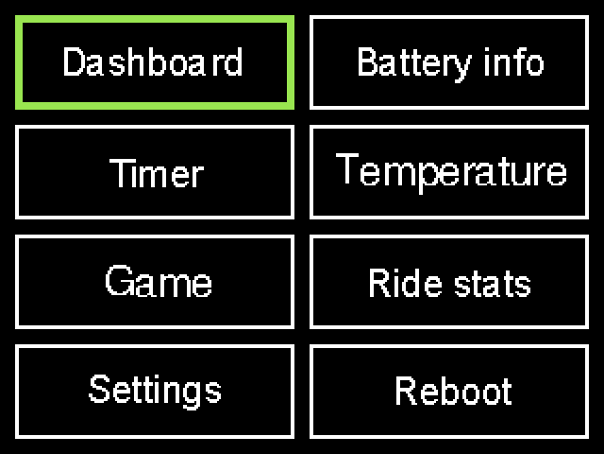
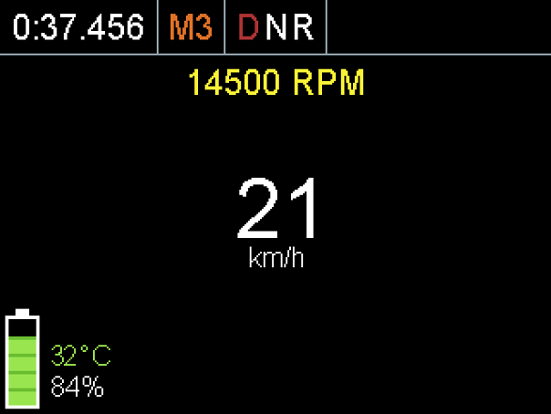
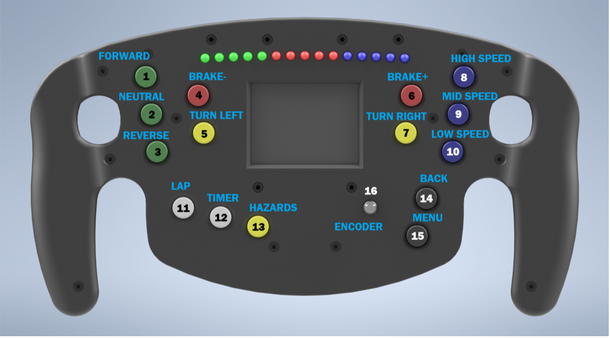
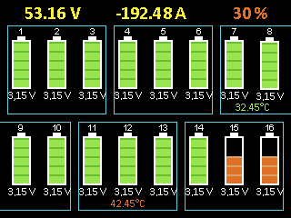
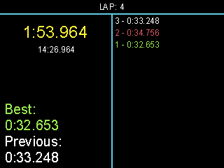
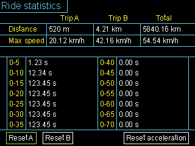
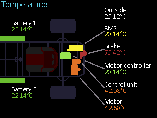
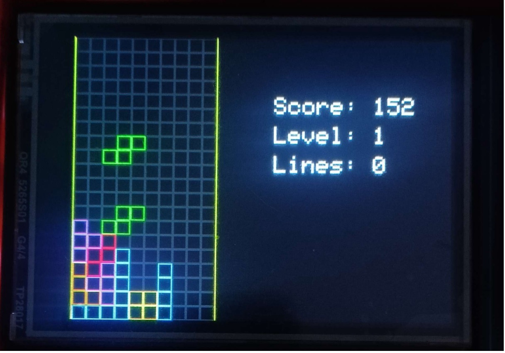

# Steering Wheel Firmware for AF-23 Formula

This firmware was developed as part of my graduation project for the AF-23 electric formula car. It runs on a custom-built steering wheel that provides the driver with real-time information and complete control of the vehicle. The wheel communicates with the main control unit over UART and features a screen to display essential driving data.

## Overview

The main objectives of this firmware are:

- **Reliable communication** with the main control unit via serial interface
- **Clear and timely display** of vital vehicle parameters like speed, battery status, and motor temperature
- **Driver control** over vehicle modes and functions through physical buttons and a rotary encoder

The firmware is written in **C++** using the [Arduino-Pico framework](https://github.com/earlephilhower/arduino-pico), which provides Arduino-compatible APIs for the Raspberry Pi Pico platform. This allows us to leverage high-quality Arduino libraries while avoiding the limitations of the native SDK.

---

## Architecture

The firmware follows a modular design, divided into these main components:

### 1. **Applications**
Self-contained modules that handle specific functionality such as:
- **Dashboard**
- **Battery Monitor**
- **Lap Timer**

Each application includes:
- An **initialization function** (`init()`) for setup
- An **update function** (`update()`) called in the main loop

This approach lets us add new features without modifying the core logic.

### 2. **Hardware Drivers**
Handle direct interaction with physical components:
- `InputHandler` for buttons and encoder
- `DisplayController` for TFT display
- Serial communication with the control unit
- LED status indicators

Drivers are specialized and don't need to follow a strict common interface.

### 3. **Main Loop**
Handles the orchestration:
- Updates the active application
- Processes input
- Polls and updates hardware state

---

## Features

### 🧭 **Menu**
- Simple, intuitive navigation using a rotary encoder
- Dynamically lists available apps
- Pressing the encoder button selects and launches apps



### 📊 **Dashboard**
- Displays:
  - Vehicle speed
  - Motor RPM and temperature
  - Battery status
  - Drive direction and mode
  - Lap time
- Connected to control unit via serial link for real-time data
- RGB LEDs indicate:
  - Speed (progressively lit)
  - Braking (blinking)
  - Low battery (alert flashes)



### 🔘 **Button Functions**
The steering wheel includes **16 buttons** mapped to key functions:
- Drive direction: `Forward`, `Neutral`, `Reverse`
- Regenerative braking: `Brake+`, `Brake-`
- Speed modes: `High`, `Mid`, `Low`
- Timer: `Lap`, `Timer`
- Spoiler indicators: `Turn Left`, `Turn Right`, `Hazards`
- UI: `Menu`, `Back`, `Encoder button (OK)`



### 🔋 **Battery Monitoring App**
- Displays:
  - Overall voltage (% and V)
  - Cell volatage and temperature
  - Current electric output
- Highlights cells in red when they cross critical thresholds
- Continuously updated from the control unit



### ⏱️ **Lap Timer App**
- Start/stop timing
- Log laps
- Track best and current lap times
- Clear history



### 🚗 **Ride Stats**
The **Ride Stats** app shows essential performance data:
- Maximum speed reached during the ride
- Maximum engine RPM
- Highest recorded acceleration (in 5 km/h segments)
- Distance traveled during the current ride
- Total distance accumulated over all rides



### 🌡️ **Temperature Monitoring**
The **Temperature Monitoring** app allows the driver to track temperatures from sensors placed throughout the vehicle. This gives the driver real-time information about the thermal load on key components like the motor, battery, motor controller, and brakes.



### 🎮 **Game**
The firmware includes a simple Tetris-inspired game that showcases the display and control capabilities. Falling pieces drop on the left side of the screen, and the player can rotate and move them using the steering wheel buttons to clear full rows.

Score and level are displayed on the right side of the screen.

This game demonstrates the interactive capabilities of the system while providing a fun diversion.



---

## Getting Started

### Prerequisites

- [PlatformIO](https://platformio.org/) IDE or CLI
- Compatible board: **Raspberry Pi Pico**

### Building and Uploading

```bash
git clone https://github.com/aldorfjakub/AF23_VOLANT.git
cd af23-steering-firmware
pio run --target upload
```

## License

This project is licensed under the MIT License.

## Acknowledgements

Special thanks to my classmate Patrik Švoma for collaborating on this project, and to the previous students who originally designed and built the AF-23 electric formula.